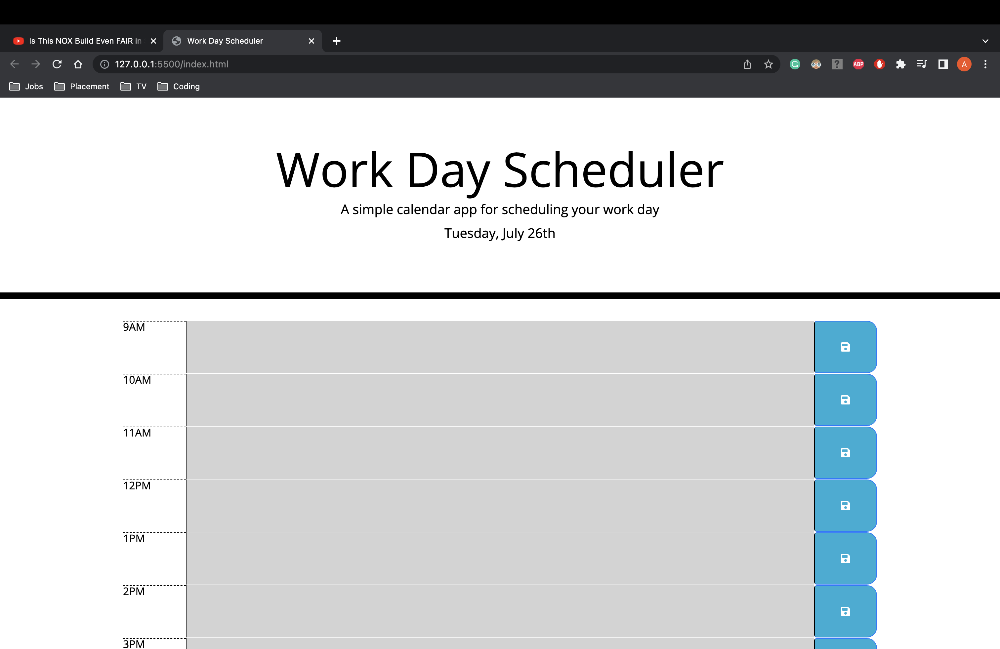

# Work-Day-Planner

In this repository I have made a work day planner that conists of the working hours , 9am - 5pm. This allows users to plan their work day and organise themselves. Below are the things I have included in the planner and a preview of my planner:

1. I made a time block for each hour from 9am to 5pm alongside a description box to write tasks down.

2. I used font awesome to create a save button which enabled me to set the users amendments to the local storage.

3. I also added an alert to notify the user that their task has been saved.

4. I then used that local storage so when the user refreshes the text remains on screen.

5. Finally, I categorised the past,present and future via colours; grey,red and green, respectfully.

## Preview:

  

Deployed URL: https://ahmeds226.github.io/Work-Day-Planner/
